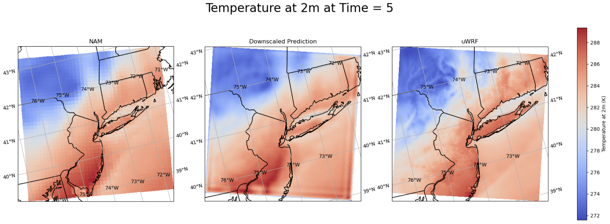

# ML-Based Downscaling of Low-Resolution Weather Forecasts over New York City 🌧️

## Overview

Welcome!

 This repository deploys an updated PyTorch version of the [**dl4ds**](https://github.com/carlos-gg/dl4ds) library. dl4ds is an open-source deep learning library designed for downscaling climate datasets. My goal is to use machine learning methods to improve the spatial resolution of weather forecast data to enhance its accuracy and usability for energy system planners. The resulting high resolution forecast data is used by colleagues in the renewable energy group to predict energy demand, renewable generation and outages.


## Directory Overview


(1) **analysis**

Exploratory data analysis to understand weather forecast variables, identify patterns and examine relationships in the datasets.

(2) **cleaning**

Cleaning both low-resolution (NAM) and high-resolution (uWRF) data and splitting into training, testing and validation sets.

(3) **make-predictions**

Making predictions/downscaling unseen LR data (NAM).

(4) **pretrained-models**

Pre-trained downscaling models.

(5) **results**
 
CSV files storing model metadata, tested hyperparameters, and their associated performance metrics (MAE).

(6) **torch_dl4ds.egg-info**

Ignore. Used for library development.

(7) **torch_dl4ds**

PyTorch implementation of the DL4DS library. Added GPU tracking and reorganized transition block.

(8) **training**

Notebooks and scripts for training the downscaling models. Each notebook focuses on a specific variable.

(9) **visuals**

Visualizations of downscaled results.

(10, 11) **.gitattributes & .gitignore**

Ignore

(12) **requirements.txt**

Lists the required Python libraries to set up the virtual environment for torch_dl4ds.

(13) **setup.py**

Setup script for packaging and installing the library.

## Goal 🎯

We apply a deep learning model to transform the coarse-resolution NAM forecasts into high-resolution weather forecasts, specifically tailored for New York City tristate area. At it's current stage, the model only downscales NAM data spatially (12km to 3km). We eventually hope to downscale NAM temporally (3-hourly to hourly). This effort provides access to more high resolution data that can be used for energy system planning. 

## Setup Instructions

1. Clone this repository:
   ```bash
   git clone https://github.com/gabbyvaillant/downscaling.git
   
   cd downscaling
   ```

2. Create a new virtual enviornment using Python 3.11.13

```
conda create -n downscaling python= 3.11.13

conda activate downscaling

```

3. Install the necessary libraries

```bash

pip install -r requirements.txt

```

3. Run downscaling model for Temperature on the NYC Tristate area

```bash

cd /downscaling/training

#Open Jupyter
jupyter lab
```

4. Check results

In the results directory, there is a .csv holding information about the different models that were tested. Here we can compare the loss and the training time.

## Data 📊

##  **High-resolution Data: Urban Weather Research & Forecasting Model (uWRF)**

Accessibility: Provided from collaborators at the University at Albany.

Resolution:  3km x 3km at 3-hourly temporal granularity.

## **Low-Resolution Data: The North American Mesoscale (NAM) model**

Accessibility: [**Order NAM Forecast Data Here**](https://www.ncei.noaa.gov/has/HAS.FileAppRouter?datasetname=NAM218&subqueryby=STATION&applname=&outdest=FILE)

Resolution:  12km x 12km 3-hourly temporal granularity.
